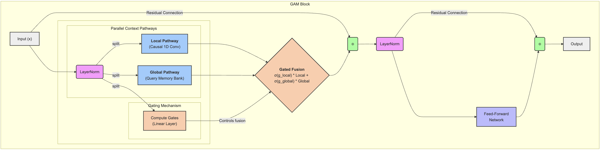

# Gated Associative Memory: A Parallel O(N) Architecture for Efficient Sequence Modeling

[](https://arxiv.org/abs/submit/6751280) <!-- Replace with final arXiv ID when available -->
[](https://opensource.org/licenses/Apache-2.0)
[](https://pytorch.org/)

This is the official PyTorch implementation for the paper **"Gated Associative Memory: A Parallel O(N) Architecture for Efficient Sequence Modeling"** by Rishiraj Acharya.

This repository contains the source code for the GAM model (`gam_model.py`), the main benchmarking script to reproduce experimental results (`benchmark.py`), and the scaling analysis script (`scale.py`).

### Abstract
The Transformer architecture, while powerful, scales quadratically with sequence length (O(N²)), creating a bottleneck for long-context tasks. We propose the **Gated Associative Memory (GAM)** network, a novel, fully parallel architecture for sequence modeling that exhibits linear complexity (O(N)). The GAM block replaces self-attention with two parallel pathways: a causal convolution to capture local context and a parallel associative memory retrieval mechanism for global, content-based patterns. These pathways are dynamically fused via a learned gating mechanism. Our experiments on WikiText-2 and TinyStories show that GAM is consistently faster and achieves superior or competitive perplexity compared to standard Transformer and Mamba baselines, establishing it as a promising and efficient alternative for sequence modeling.

## Key Features
- **Linear Complexity**: O(N) time and memory complexity, enabling efficient processing of very long sequences.
- **Fully Parallelizable**: The architecture contains no recurrent components, allowing for maximum utilization of modern hardware like GPUs.
- **Dual-Pathway Design**: Explicitly decomposes context modeling into a **Local Pathway** (Causal Convolution) for syntax and a **Global Pathway** (Associative Memory) for semantics.
- **Dynamic Gating**: A learned mechanism dynamically fuses local and global information on a per-token basis, adding expressivity.
- **Superior Performance**: Outperforms strong Transformer and Mamba baselines in both speed and perplexity on benchmark datasets.

## Architecture: The GAM Block

The core of our model is the `GAMBlock`, which replaces the traditional multi-head self-attention layer.


> **Figure 1:** The input `x` is normalized and then processed by two parallel pathways. The Local Pathway uses a Causal 1D Convolution, while the Global Pathway queries a learnable Memory Bank. The outputs are dynamically combined by a learned gate and added to the residual connection, followed by a standard FFN.

## Installation

1.  **Clone the repository:**
    ```bash
    git clone https://github.com/rishiraj/gam.git
    cd gam
    ```

2.  **Create a virtual environment (recommended):**
    ```bash
    python -m venv venv
    source venv/bin/activate  # On Windows, use `venv\Scripts\activate`
    ```

3.  **Install the required dependencies:**
    A `requirements.txt` file is provided for easy setup.
    ```bash
    pip install -r requirements.txt
    ```

## Usage

This repository contains three main Python scripts.

### 1. Reproducing Benchmark Results (`benchmark.py`)

This script runs the main comparative experiments from the paper (Section 4), training and evaluating GAM, Transformer, and Mamba models on WikiText-2 and TinyStories.

**Setup:**
The script uses `wandb` for logging. Please log in to your account and configure the `WANDB_ENTITY` variable in `benchmark.py` with your username or team name.

**Run the full benchmark:**
```bash
python benchmark.py
```
The script will sequentially:
1.  Download and prepare the WikiText-2 dataset.
2.  Train and evaluate GAM, Transformer, and Mamba on WikiText-2.
3.  Download and prepare the TinyStories dataset.
4.  Train and evaluate GAM and Transformer on TinyStories.

All results, including training loss, validation perplexity, and epoch times, will be logged to your Weights & Biases project.

### 2. Running the Scaling Benchmark (`scale.py`)

This script reproduces the targeted scaling analysis from Section 5.2 of the paper, measuring the forward+backward time and peak memory usage of a single GAM block vs. a Transformer block as sequence length increases.

**Run the scaling analysis:**
```bash
python scale.py
```
The script will output a table of results directly to the console and save plots (`compute_time.png` and `peak_memory.png`) to the current directory, visually demonstrating GAM's linear scaling compared to the Transformer's quadratic growth.

### 3. Using `GAM_Model` as a Standalone Module

You can easily import and use the `GAM_Model` in your own projects. The model implementation is self-contained in `gam_model.py`.

Here is a minimal example:
```python
import torch
from gam_model import GAM_Model, ModelConfig

# 1. Define the model configuration
config = ModelConfig(
    VOCAB_SIZE=10000,
    BLOCK_SIZE=256,
    N_EMBED=512,
    N_LAYER=6,
    NUM_MEMORY_SLOTS=512,
    CONV_KERNEL_SIZE=3
)

# 2. Initialize the model
model = GAM_Model(config)
device = "cuda" if torch.cuda.is_available() else "cpu"
model.to(device)

print(f"Model initialized with {sum(p.numel() for p in model.parameters()):,} parameters.")

# 3. Create dummy data and run a forward pass
dummy_input = torch.randint(0, config.VOCAB_SIZE, (8, 128), device=device)
logits, loss = model(dummy_input, targets=dummy_input)

print(f"Output logits shape: {logits.shape}")
print(f"Calculated loss: {loss.item()}")
```

## Results

Our experiments confirm that GAM is both faster and more accurate than the baselines.

### Main Benchmark Results (Table 1)

| Dataset     | Model       | Params | Avg. Time / Epoch (s) | Val. Loss | Val. PPL |
|-------------|-------------|--------|-----------------------|-----------|----------|
| **WikiText-2**  | Transformer | 24.2 M | 131.9 s               | 6.8233    | 918.99   |
|             | Mamba       | 20.5 M | 127.1 s               | 6.9251    | 1017.54  |
|             | **GAM (Ours)**  | 22.6 M | **117.2 s**           | **6.7828**| **882.57**   |
| **TinyStories** | Transformer | 24.2 M | 671.6 s               | 3.1591    | 23.55    |
|             | **GAM (Ours)**  | 22.6 M | **601.4 s**           | **3.1418**| **23.15**    |

### Scaling Benchmark Results (Table 2)

GAM demonstrates clear linear (`O(N)`) scaling in time and memory, whereas the Transformer shows quadratic (`O(N²)`) growth and fails with Out-of-Memory (OOM) errors on longer sequences.

| Sequence Length | Time (ms) - GAM | Time (ms) - Transformer | Memory (MB) - GAM | Memory (MB) - Transformer |
|-----------------|-----------------|---------------------------|-------------------|-----------------------------|
| 256             | **8.97**        | 8.90                      | **179.42**        | 216.03                      |
| 512             | **13.09**       | 23.86                     | **325.48**        | 552.98                      |
| 1024            | **25.86**       | 74.19                     | **617.60**        | 1964.79                     |
| 2048            | **51.94**       | 279.37                    | **1201.85**       | 7483.92                     |
| 4096            | **105.03**      | Failed (OOM)              | **2370.35**       | Failed (OOM)                |
| 8192            | **217.30**      | Failed (OOM)              | **4707.35**       | Failed (OOM)                |


### Ablation Study (Table 3)
Our ablation study on WikiText-2 confirms that all components of the GAM block are essential for peak performance.

| Model Configuration | Gating? | Local? | Global? | Params | Val. PPL |
|---------------------|:-------:|:------:|:-------:|--------|----------|
| **GAM (Full)**          |    ✅    |   ✅    |    ✅    | 22.6 M | **900.84**   |
| GAM (Global Only)   |    ❌    |   ❌    |    ✅    | 19.4 M | 905.45   |
| GAM (Sum Fusion)    |    ❌    |   ✅    |    ✅    | 19.4 M | 942.59   |
| GAM (Local Only)    |    ❌    |   ✅    |    ❌    | 17.9 M | 944.70   |

Key takeaways:
1.  **Gating is crucial for effective fusion**: Simple summation performs poorly.
2.  **Global associative memory is the primary driver of performance**: The `Global Only` model is very strong.
3.  **Local context is complementary and necessary**: The full model still outperforms `Global Only`, while `Local Only` is insufficient.

## Citation
If you find this work useful in your research, please consider citing our paper:
```bibtex
@article{acharya2025gam,
  title={{Gated Associative Memory: A Parallel O(N) Architecture for Efficient Sequence Modeling}},
  author={Acharya, Rishiraj},
  journal={arXiv preprint arXiv:submit/6751280},
  year={2025}
}
```
